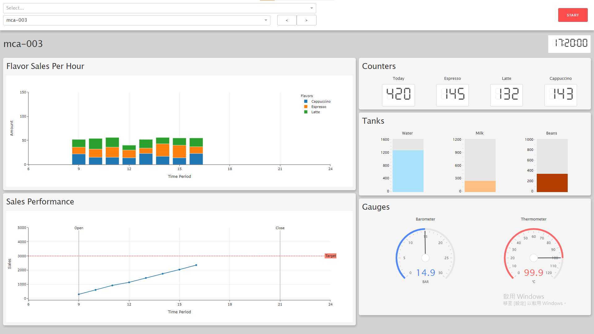

# Coffee Machine Dashboard

## Introduction
`coffee-machine-dashboard` 是個用於監控咖啡機台生產狀態的數位儀表板。
這是個展示用的專案，前端是以 Web App 方式呈現，主要透過互動式 Web App 框架 Dash 來建構。

## Screenshot

## Built With
* [Dash interactive Python framework](https://dash.plotly.com/) - 主要運行伺服器與 HTML 元件的建構。
* [Plotly](https://plotly.com/python/) - 互動式圖表繪製。
* [Heroku Application Clould Platform](https://www.heroku.com/home) - Web App 的部屬（Deploy）。
* [Heroku Postres](https://devcenter.heroku.com/articles/heroku-postgresql) - Database 伺服器，資料存取。

### Other Related Modules
* [Python.random](https://docs.python.org/3/library/random.html) - Dummy 資料生成
* [Python.datetime](https://docs.python.org/3/library/datetime.html) - 時間資料處理
* [Python.os.path](https://docs.python.org/3/library/os.path.html) - 檔案路徑處理
* [Pandas](https://pandas.pydata.org) - 資料結構與分析

## How to use this app
展示連結：[Coffee Machine Dashboard](https://coffee-machine-dashboard.herokuapp.com/)
※ 由於展示用的伺服器使用免費版，一段時間未使用會進入休眠，導致下次開啟需要 1、2分鐘啟動，還請耐心等待。

進入網站後，左上方是顯示內容的篩選選單，分別是選擇「門市」與「機台」。

模擬的情境中，共有 3間門市，分別有 2、3台咖啡機，營業時間都是從 09:00 至 21:00。

右上方的「START / STOP」按鈕在點選後，會開始 / 暫停內容的更新。按鈕下方的時間則是參考的運作時間，為了方便展示，以每 2秒為 10分鐘快轉（不過目前快轉導致延遲變得非常明顯，可以適度暫停來瀏覽）。

內容左方圖表分別是咖啡機的「各口味銷售紀錄 (Flavor Sales Per Hour)」與「銷售額紀錄 (Sales Performance)」，每小時更新一次。

而內容右方則是「生產計數器 (Counter)」、「材料槽狀態 (Tanks)」、「生產參數顯示器 (Gauges)」，每分鐘更新一次。
